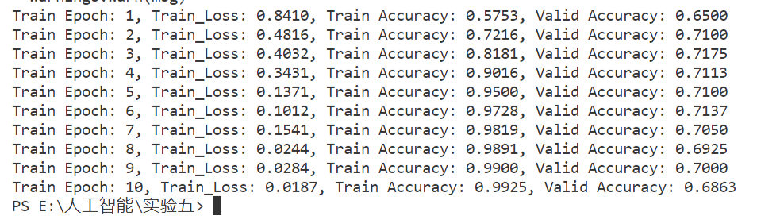
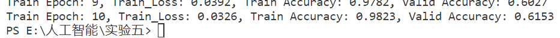
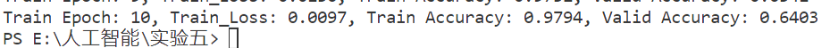
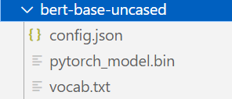

# 多模态情感分析
###### 姓名：李欣然 学号:10215501425
###### github地址：https://github.com/ranwan20/Model-ai（p.s.'bert-base-uncased'文件太大就没有上传到github，邮件压缩包添加了该模型。
#### 实验要求
设计一个多模态融合模型。
自行从训练集中划分验证集，调整超参数。
预测测试集（test_without_label.txt）上的情感标签。
#### 实验过程
定义了一个名为Model的多模态融合模型，这也是本次实验的主要部分，它由文本模型和图像模型组成，并将它们的输出连接起来进行分类。
在__init__方法中，模型定义了以下组件：
txt_model：使用预训练的Bert模型，通过BertModel.from_pretrained方法加载了一个基于bert-base-uncased的模型。
img_model：使用预训练的ResNet-18模型，通过torchvision.models.resnet18(pretrained=True)加载了一个预训练模型。
linear1：一个线性层，将文本模型的输出维度（768）映射到128维。
linear2：一个线性层，将图像模型的输出维度（1000）映射到128维。
fc：一个线性层，将文本和图像模型的输出连接起来，并将结果映射到3维，用于分类。
relu：ReLU激活函数。

在forward方法中，模型定义了数据在前向传播过程中的流动方式：
图像通过图像模型（img_model）进行处理，得到图像的特征表示（img_out）。
图像特征经过线性层（linear2）和ReLU激活函数（relu）的处理后，得到处理后的图像特征（img_out）。
文本数据通过文本模型（txt_model）进行处理，得到文本的特征表示（txt_out）。这里使用了Bert模型的last_hidden_state属性获取最后一层的隐藏状态。
通过切片操作，提取文本特征的第一个词的表示（txt_out.last_hidden_state[:,0,:]）。
使用view方法将文本特征的形状调整为(batch_size, -1)，其中batch_size是输入数据的批大小。
文本特征经过线性层（linear1）和ReLU激活函数（relu）的处理后，得到处理后的文本特征（txt_out）。
将文本和图像特征在最后一个维度上进行拼接，并通过线性层（fc）进行分类。
最后，返回分类结果（out）。
这个模型将文本和图像特征结合起来，通过训练来学习如何将它们有效地组合以进行分类任务。
```python
class Model(nn.Module):
    def __init__(self):
        super().__init__()
        self.txt_model = BertModel.from_pretrained('./bert-base-uncased')
        self.img_model = torchvision.models.resnet18(pretrained=True)
        self.linear1 = nn.Linear(768, 128)
        self.linear2 = nn.Linear(1000, 128)
        self.fc = nn.Linear(256, 3)
        self.relu = nn.ReLU()

    def forward(self, input_ids, attention_mask, image):
        img_out = self.img_model(image)
        img_out = self.linear2(img_out)
        img_out = self.relu(img_out)
        txt_out = self.txt_model(input_ids=input_ids, attention_mask=attention_mask)
        txt_out = txt_out.last_hidden_state[:,0,:]
        txt_out.view(txt_out.shape[0], -1)
        txt_out = self.linear1(txt_out)
        txt_out = self.relu(txt_out)
        out = torch.cat((txt_out, img_out), dim=-1)
        out = self.fc(out)
        return out
```

分别定义了txtonlyModel和imgonlyModel，只输入文本或图像数据，用于得到消融实验结果。
```python
class txtonlyModel(nn.Module):
    def __init__(self):
        super().__init__()
        self.txt_model = BertModel.from_pretrained('bert-base-uncased')
        self.linear = nn.Linear(768, 256)
        self.fc = nn.Linear(256, 3)
        self.relu = nn.ReLU()

    def forward(self, input_ids, attention_mask, image):
        txt_out = self.txt_model(input_ids=input_ids, attention_mask=attention_mask)
        txt_out = txt_out.last_hidden_state[:,0,:]
        txt_out.view(txt_out.shape[0], -1)
        txt_out = self.linear(txt_out)
        txt_out = self.relu(txt_out)
        out = self.fc(txt_out)
        return out
```
```python
class imgonlyModel(nn.Module):
    def __init__(self):
        super().__init__()
        self.img_model = torchvision.models.resnet18(pretrained=True)
        self.linear = nn.Linear(1000, 256)
        self.fc = nn.Linear(256, 3)
        self.relu = nn.ReLU()


    def forward(self, input_ids, attention_mask, image):
        img_out = self.img_model(image)
        img_out = self.linear(img_out)
        img_out = self.relu(img_out)
        out = self.fc(img_out)
        return out
```
函数对文本进行处理，得到input_ids和attention_mask。input_ids是编码后的文本的张量表示，attention_mask是注意力掩码，用于指示哪些标记是有效的。
```python
def txt_(txt, token):
    result = token.batch_encode_plus(batch_text_or_text_pairs=txt, truncation=True, padding='max_length', max_length=32, return_tensors='pt')
    input_ids = result['input_ids']
    attention_mask = result['attention_mask']
    return input_ids, attention_mask
```
将图像、描述和标签数据组合在一起，并提供方便的访问接口。在使用时，可以通过索引来获取对应的图像、描述、标签以及编码后的文本数据和注意力掩码。
```python
class MultimodalDataset():
    def __init__(self, images, descriptions, tags, token):
        self.images = images
        self.descriptions = descriptions
        self.tags = tags
        self.input_ids, self.attention_masks = txt_(self.descriptions, token)

    def __len__(self):
        return len(self.descriptions)

    def __getitem__(self, idx):
        img = self.images[idx]
        des = self.descriptions[idx]
        tag = self.tags[idx]
        input_id = self.input_ids[idx]
        attention_mask = self.attention_masks[idx]
        return img, des, tag, input_id, attention_mask
```
根据给定的模型、优化器和数据加载器进行训练，并在每个epoch结束时打印训练和验证的损失以及准确率。
```python
device = torch.device("cuda:0" if torch.cuda.is_available() else "cpu")
def train_process(model, epoch_num, optimizer, train_dataloader, valid_dataloader, train_count, valid_count):
    Loss_C = nn.CrossEntropyLoss()
    train_acc = []
    valid_acc = []
    for epoch in range(epoch_num):
        loss = 0.0
        train_cor_count = 0
        valid_cor_count = 0
        for b_idx, (img, des, target, idx, mask) in enumerate(train_dataloader):
            img, mask, idx, target = img.to(device), mask.to(device), idx.to(device), target.to(device)
            output = model(idx, mask, img)
            optimizer.zero_grad()
            loss = Loss_C(output, target)
            loss.backward()
            optimizer.step()
            pred = output.argmax(dim=1)
            train_cor_count += int(pred.eq(target).sum())
        train_acc.append(train_cor_count / train_count)
        for img, des, target, idx, mask in valid_dataloader:
            img, mask, idx, target = img.to(device), mask.to(device), idx.to(device), target.to(device)
            output = model(idx, mask, img)
            pred = output.argmax(dim=1)
            valid_cor_count += int(pred.eq(target).sum())
        valid_acc.append(valid_cor_count / valid_count)
        print('Train Epoch: {}, Train_Loss: {:.4f}, Train Accuracy: {:.4f}, Valid Accuracy: {:.4f}'.format(epoch + 1, loss.item(), train_cor_count / train_count, valid_cor_count / valid_count))
```
主函数解析命令行参数，选择适当的模型进行训练和预测。读取训练数据，包括图像、描述和标签，并对描述文本进行预处理。然后，将数据集划分为训练集和验证集，并创建相应的数据加载器，使用选择的模型和优化器进行训练，并在每个训练轮次中评估模型在验证集上的性能。最后，读取测试数据的guid列表，并使用训练好的模型进行预测，并将预测结果保存到文件中。
```python
def main():
    parser = argparse.ArgumentParser(description='params') 
    parser.add_argument('--image_only', action='store_true')
    parser.add_argument('--text_only', action='store_true')
    args = parser.parse_args()
    if args.image_only:
        model = imgonlyModel().to(device)
    if args.text_only:
        model = txtonlyModel().to(device)
    else:
        model = Model().to(device)

    optimizer = optim.AdamW(model.parameters(), lr=1e-5)
    epoch_num = 10
    images = []
    descriptions = []
    tags = []
    tag_ = {"neutral": 0, "negative": 1, "positive": 2}
    train_df = pd.read_csv("./train.txt")
    token = BertTokenizer.from_pretrained('./bert-base-uncased')

    for i in range(train_df.shape[0]):
        guid = train_df.iloc[i]['guid']
        tag = train_df.iloc[i]['tag']
        img = Image.open('./data/' + str(guid) + '.jpg')
        img = img.resize((224, 224), Image.LANCZOS)
        img = np.asarray(img, dtype='float32')
        with open('./data/' + str(guid) + '.txt', encoding='gb18030') as f:
            des = f.read()
        images.append(img.transpose(2, 0, 1))
        descriptions.append(des)
        tags.append(tag_[tag])
 
    for i in range(len(descriptions)):
        a = descriptions[i]
        word_list = a.replace("#", "").split(" ")
        words_result = []
        for word in word_list:
            if len(word) < 1:
                continue
            elif word[0]=='@':
                continue
            else:
                words_result.append(word)
        descriptions[i] = " ".join(words_result)
    img_txt_pairs = [(images[i], descriptions[i]) for i in range(len(descriptions))]
    
    X_train, X_valid, tag_train, tag_valid = train_test_split(img_txt_pairs, tags, test_size=0.2, random_state=1458, shuffle=True)
    image_train, txt_train = [X_train[i][0] for i in range(len(X_train))], [X_train[i][1] for i in range(len(X_train))]
    image_valid, txt_valid = [X_valid[i][0] for i in range(len(X_valid))], [X_valid[i][1] for i in range(len(X_valid))]

    train_dataset = MultimodalDataset(image_train, txt_train, tag_train, token)
    train_dataloader = torch.utils.data.DataLoader(train_dataset, batch_size=64, shuffle=True)
    valid_dataset = MultimodalDataset(image_valid, txt_valid, tag_valid, token)
    valid_dataloader = torch.utils.data.DataLoader(valid_dataset, batch_size=64, shuffle=True)

    train_process(model, epoch_num, optimizer, train_dataloader, valid_dataloader, len(X_train), len(X_valid))
 
    tag_list = ["neutral", "negative", "positive"]
    test_df = pd.read_csv("./test_without_label.txt")
    guid_list = test_df['guid'].tolist()
    tag_test_list = []
    for idx in guid_list:
        img = Image.open('./data/' + str(idx) + '.jpg')
        img = img.resize((224,224), Image.LANCZOS)
        image = np.asarray(img, dtype = 'float32')
        image = image.transpose(2,0,1)
        with open('./data/' + str(idx) + '.txt', encoding='gb18030') as fp:
            description = fp.read()
        input_id, mask = txt_([description],token)
        image = image.reshape(1,image.shape[0],image.shape[1],image.shape[2])
        y_pred = model(input_id.to(device), mask.to(device), torch.Tensor(image).to(device))
        tag_test_list.append(tag_list[y_pred[0].argmax(dim=-1).item()])
    
    result_df = pd.DataFrame({'guid':guid_list, 'tag':tag_test_list})
    result_df.to_csv('./test_with_label.txt',sep=',',index=False)
```

#### 实验结果及分析
在命令行中输入`python hw5.py`，得到：

在命令行中输入`python hw5.py --txt_only`，得到只输入文本的消融实验结果：

在命令行中输入`python hw5.py --image_only`，得到只输入图片的消融实验结果：

可以看到，综合了文本和图像后，在验证集上的准确率高达0.69，而只输入文本只有0.61，只输入图像只有0.64。综合了两种模态的实验结果在验证集上的准确率要高于只有文本或者图像的准确率，消融实验的模型预测效果很不好。模型在训练集上的准确度有0.99，在验证集上却只有0.69，原因是训练集给出的数据较少，如果增加训练集数据，模型的预测效果应该会更好。

#### 遇到的bug
`OSError: We couldn't connect to 'https://huggingface.co' to load this file, couldn't find it in the cached files and it looks like bert-base-uncased is not the path to a directory containing a file named config.json.
Checkout your internet connection or see how to run the library in offline mode at 'https://huggingface.co/docs/transformers/installation#offline-mode'.`
这是由于连接不上网站 https://huggingface.co 导致的无法加载模型bert-base-uncased。解决方法是在 https://huggingface.co 官网上搜索模型bert-base-uncased，下载以下三个文件保存在代码文件夹下，代码载入模型时直接载入下载的文件。


#### 实验总结
本次实验通过设计多模态融合模型，探索了多种模态信息对情感分析任务的影响。实验结果表明，综合多种模态的信息可以提高模型的预测性能，对于情感分析任务具有重要意义。然而，模型的预测性能仍有改进的空间，可以通过增加训练集数据和调整模型超参数等方式进一步提高模型的性能。